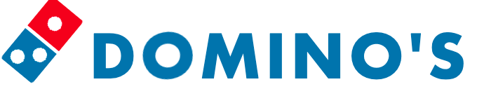

# Procesverslag
**Auteur:** Esra Kahraman

**De opdrachten:** [opdracht 1](opdracht1/index.html) en [opdracht 2](opdracht2/index.html)

Markdown is een simpele manier om HTML te schrijven.  
Markdown cheat cheet: [Hulp bij het schrijven van Markdown](https://github.com/adam-p/markdown-here/wiki/Markdown-Cheatsheet).

Nb. De standaardstructuur en de spartaanse opmaak van de README.md zijn helemaal prima. Het gaat om de inhoud van je procesverslag. Besteedt de tijd voor pracht en praal aan je website.

Nb. Door *open* toe te voegen aan een *details* element kun je deze standaard open zetten. Fijn om dat steeds voor de relevante stuk(ken) te doen.

## Bronnenlijst
  1. bron: https://www.simplilearn.com/tutorials/css-tutorial/css-keyframes#css_keyframes_example_1
  2. bron: https://stackoverflow.com/questions/22352311/how-do-i-draw-a-diagonal-div
  3. bron: https://www.w3schools.com/howto/howto_css_responsive_text.asp 

## Opdracht 1 plan

  
uitwerken na schetsen idee (voor week 2)

  ### Je storyboard:
  

  ### Je ambitie: 
  Aan deze technieken/punten wil ik werken:
  - Ik wil er voor zorgen dat ik voor week 2 mijn font er in heb kunnen verwerken;
  - Ik wil alvast het domino steentje voor het logo er in coderen;
 

## Opdracht 1 reflectie

  
uitwerken bij afronden opdracht (voor week 4)

  ### Je uitkomst - karakteristiek screenshot(s):
  

  ### Dit ging goed/Heb ik geleerd: 
 Ik heb nu geleerd hoe je vormen in je css kan coderen zonder een afbeelding te gebruiken en hoe je iets kan roteren door middel van animatie.

  

  ### Dit was lastig/Is niet gelukt:
 Het is mij nog niet gelukt om de rest van de letters ook om te laten vallen. Tot nu tikt alleen het domino steentje tegen de letter 'D' aan, maar ik wil er ook nog voor zorgen dat de rest nog gaat omvallen. Omdat ik 'before' heb gebruikt, gaat de letter 'D' ook mee met het roteren, dus ik moet er even achter zien te komen hoe ik dit voorkom.

  

## Opdracht 2 plan

  
uitwerken na schetsen idee (voor week 5)

  ### Je ontwerp:
  

  ### Je ambitie: 
  Aan deze technieken/punten wil ik werken:
  - Ik wil er voor zorgen dat de gebruiker een nummer kan toevoegen;
  - Ik wil er voor zorgen dat de gebruiker nummers kan sorteren;
  - Ik wil ervoor zorgen dat mijn website er netjes uit ziet.

## Opdracht 2 test

  
uitwerken na testen (week 7)

  Neem minimaal 5 bevindingen op:

  ### Bevinding 1:
  Omschrijving van wat er nog niet orde was (tekst en afbeeding(en)).

  #### oplossing:
  Beschrijving hoe je het hebt hebt opgelost of als het niet gelukt is hoe je het zou oplossen (tekst en afbeeding(en)).

  ### Bevinding 2:
  Omschrijving van wat er nog niet orde was (tekst en afbeeding(en)).

  #### oplossing:
  Beschrijving hoe je het hebt hebt opgelost of als het niet gelukt is hoe je het zou oplossen (tekst en afbeeding(en)).

  ### Bevinding 3:
  ...

## Opdracht 2 reflectie

  
uitwerken bij afronden opdracht (voor week 8)

  ### Je uitkomst - karakteristiek screenshot(s):
  

  ### Dit ging goed/Heb ik geleerd: 
  Korte omschrijving met plaatje(s)

  

  ### Dit was lastig/Is niet gelukt:
  Korte omschrijving met plaatje(s)

  

